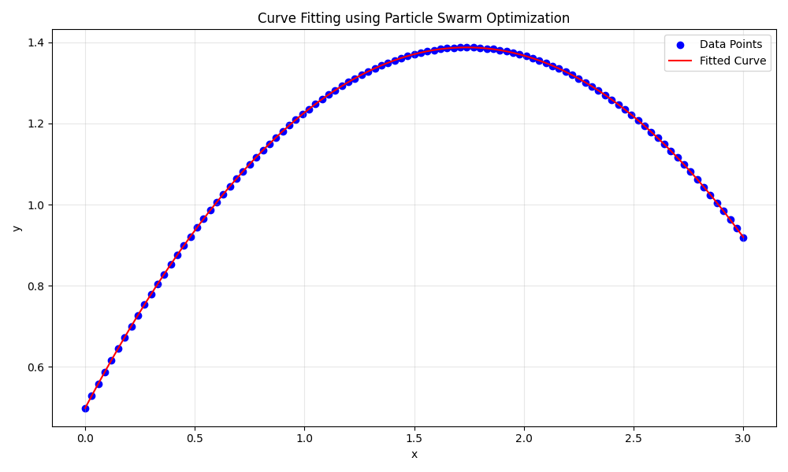
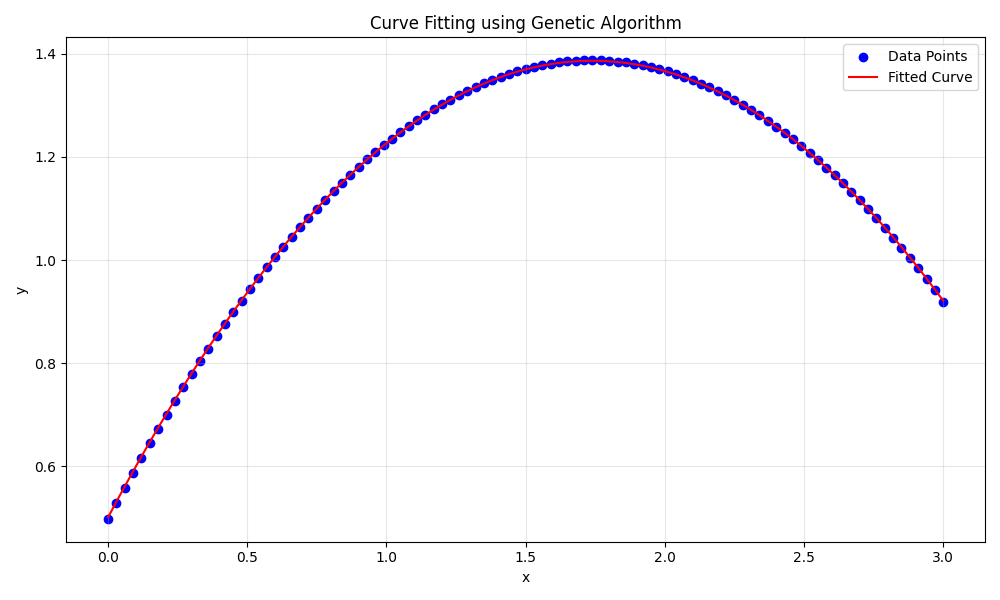
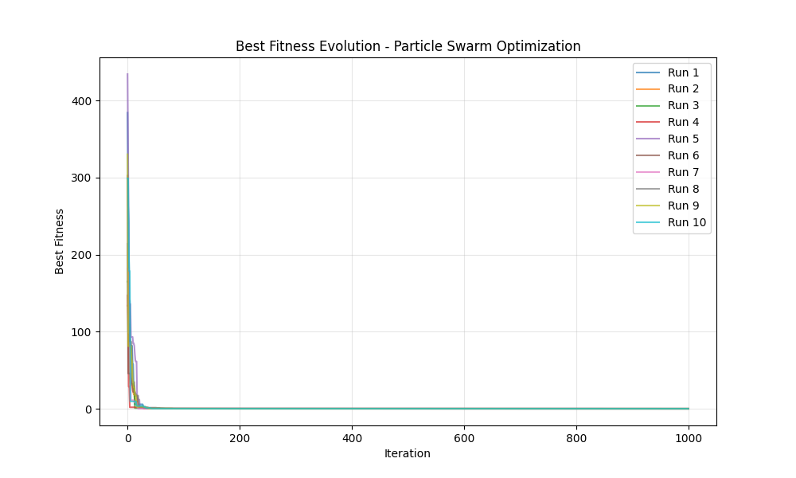
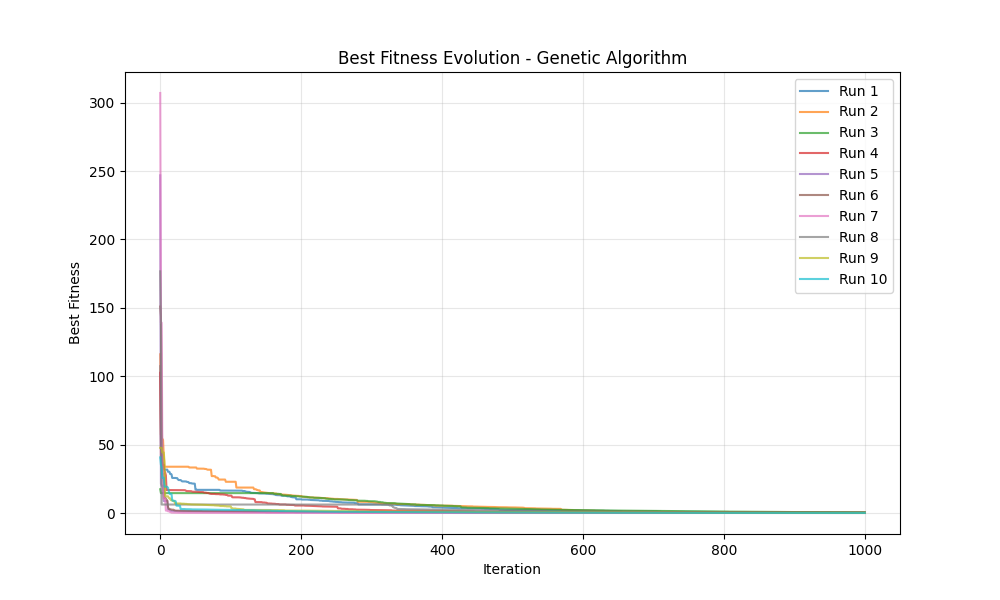

# Ajuste de Curvas por Algoritmos Evolutivos

Aplicação de dois algoritmos evolutivos, **Particle Swarm Optimization (PSO)** e **Algoritmo Genético (GA)**, ao problema de ajuste de curvas (*curve fitting*).

## O Problema

Dado um conjunto de pontos $(x_i, y_i)$, o objetivo é encontrar os coeficientes $a$, $b$ e $c$ de um polinômio quadrático:

$$\hat{y} = a + b \cdot x + c \cdot x^2$$

que minimize o erro quadrático total entre os valores preditos e os dados reais:

$$\text{fitness} = \sum_{i=1}^{n} (y_i - \hat{y}_i)^2$$

## Algoritmos

### Particle Swarm Optimization (PSO)

O PSO simula o comportamento de um bando de pássaros em busca de alimento. Cada partícula representa uma solução candidata e se move no espaço de busca influenciada pela sua melhor posição histórica e pela melhor posição já encontrada pelo enxame.

| Parâmetro | Valor |
|---|---|
| Tamanho da população | 100 partículas |
| Máximo de iterações | 1000 |
| Espaço de busca | [-5, 5] por dimensão |
| Inércia (w) | 0,729 |
| Componente cognitivo (c1) | 2 |
| Componente social (c2) | 2 |

### Algoritmo Genético (GA)

O GA é inspirado no processo de evolução natural. Uma população evolui ao longo das gerações por meio de **seleção**, **cruzamento** e **mutação**, favorecendo indivíduos com melhor aptidão.

| Parâmetro | Valor |
|---|---|
| Tamanho da população | 100 indivíduos |
| Máximo de iterações | 1000 gerações |
| Espaço de busca | [-5, 5] por dimensão |
| Probabilidade de mutação | 0,01 |
| Precisão | 1e-7 |

## Estrutura do Projeto

```
curve-fitting-by-evolutionary-algorithms/
├── main.py                        # Script principal
├── requirements.txt
├── instances/
│   └── 1/
│       ├── x_data.txt             # Dados de entrada (x)
│       └── y_data.txt             # Dados de entrada (y)
├── graphics/                      # Gráficos gerados
├── src/
│   ├── dataset.py                 # Classe Dataset
│   └── algorithms/
│       ├── algorithm.py           # Classe base abstrata
│       ├── pso_algorithm.py       # Implementação do PSO
│       └── ga_algorithm.py        # Implementação do GA
└── notebook/
    ├── curve_fitting.ipynb        # Notebook para entrega acadêmica
    ├── x_data.txt
    └── y_data.txt
```

## Como Rodar

**1. Criar e ativar o ambiente virtual:**
```bash
python -m venv venv
source venv/bin/activate      # Linux/macOS
venv\Scripts\activate         # Windows
```

**2. Instalar dependências:**
```bash
pip install -r requirements.txt
```

**3. Executar:**
```bash
python main.py
```

Os gráficos serão salvos no diretório `graphics/`.

> Para a versão interativa com gráficos inline, abra `notebook/curve_fitting.ipynb` no Jupyter Notebook ou VS Code.

## Resultados

Cada algoritmo foi executado **10 vezes de forma independente**. Os gráficos abaixo correspondem à melhor execução de cada algoritmo.

### Curva Ajustada

| PSO | GA |
|---|---|
|  |  |

### Evolução do Melhor Fitness

| PSO | GA |
|---|---|
|  |  |

### Tabela Comparativa

> Para gerar: adicione `print(dataframe.to_markdown(index=False))` ao final da execução e substitua os valores abaixo.

| Algoritmo | Fitness Médio (10 exec.) | Melhor Fitness |
|---|---|---|
| Particle Swarm Optimization | 8.315238e-08 | 8.315238e-08 |
| Genetic Algorithm | 1.034339e-01 | 6.149086e-05 |
